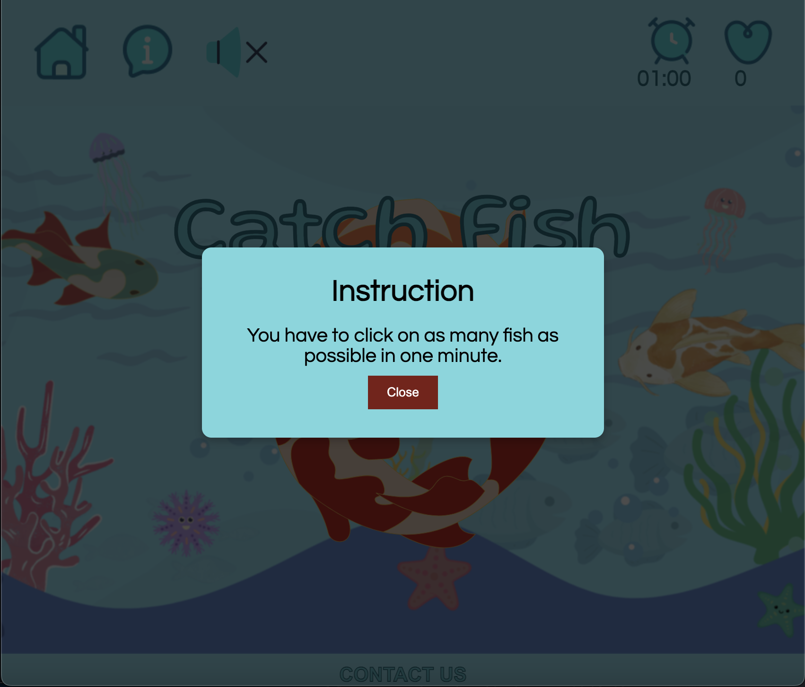

# Catch Fish
Welcome to Catch Fish, an addictive and engaging clicking adventure set in an underwater world teeming with colorful marine life. In Catch Fish, players embark on an exhilarating journey where the objective is to catch as many fish as possible by simply clicking on them.

The site can be accessed by this [link](https://anastassiiabondarenko.github.io/fish_game/)

## Visitor Goals

### First-Time Visitor Goals:

* Understand the Objective: As a first-time visitor, I want to easily understand the objective of the game, which is to catch fish.

* Learn How to Play: As a first-time visitor, I want to find instructions on how to play the game and understand the controls.

* Start Playing: As a first-time visitor, I want to have a clear and easily accessible option to start the game.

### Returning Visitor Goals:

* Improve My Score: As a returning visitor, I want to play the game again and try to improve my score from previous sessions.

* Quick Access: As a returning visitor, I want quick access to start the game without going through the initial instructions again.

* Pause and Resume: As a returning visitor, I want the ability to pause the game if I need to take a break and resume it later.

### Frequent Visitor Goals:

* Compete with Others: As a frequent user, I want the option to compete with other players, view leaderboards, or participate in challenges.

* Customization: As a frequent user, I want options to customize the game, such as choosing different backgrounds, fish types, or game modes.

* Provide Feedback: As a frequent user, I want a way to provide feedback, report issues, or suggest improvements for the game.

* Access Advanced Features: As a frequent user, I want access to advanced features or power-ups that enhance gameplay.

---

## Navigation

### Navigation Bar:

At the top of the game's interface, you'll find a navigation bar featuring essential controls and options.

### Home Icon:

* Home Icon - Clicking on the home icon will end the game and take you to the game's home view.

### Rules Icon:

- Rules Icon - By clicking on the rules icon, you can access instructions and information about how to play the game.

### Sound Control:

- Sound Icon - The sound control allows you to toggle game sounds on and off by clicking the sound icon.

### Pause Button:

- Pause Icon - Click the pause button to temporarily stop the game and access game-related options.

### Timer:

- The timer displays the remaining time in minutes and seconds during gameplay, helping you keep track of your progress.

### Score Counter:

- The score counter displays your current score, indicating how many fish you've successfully caught.

### Footer:

- At the bottom of the game interface, you can access additional information and contact details.

### Contact Information:

- In the footer, you'll find contact information for reaching out to the game's developer, including email, phone contacts and social links.

*And when you hover your mouse over each link on this website the links/icon change colour or increase, this is designed for user convenience and understanding clickable links.*

---
## Technologies Used

- [HTML](https://developer.mozilla.org/en-US/docs/Web/HTML) was used as the foundation of the site.
- [CSS](https://developer.mozilla.org/en-US/docs/Web/css) - was used to add the styles and layout of the site.
- [CSS Flexbox](https://developer.mozilla.org/en-US/docs/Learn/CSS/CSS_layout/Flexbox) - was used to arrange items simmetrically on the pages.
- [JS](https://www.javascript.com/): the primary language used to develop the client side of the website.

 
- [Balsamiq](https://balsamiq.com/) was used to make wireframes for the website.
- [VSCode](https://code.visualstudio.com/) was used as the main tool to write and edit code.
- [Git](https://git-scm.com/) was used for the version control of the website.
- [GitHub](https://github.com/) was used to host the code of the website.

---
## Design

### Color Scheme

### The Catch Fish game features a vibrant and visually appealing color scheme that enhances the overall gaming experience:

- Underwater Blue: The primary background color resembles the tranquil blue hues of the ocean, creating a serene and immersive underwater setting. It evokes a sense of calm and adventure as players explore the depths.

- Playful Fish Colors: The fish in the game exhibit a variety of lively and bright colors, such as blue and orange. These colors not only make the fish visually engaging but also serve as targets for players to click on.

- Contrast and Highlight: To ensure that players can easily identify and interact with game elements, contrasting colors are used. This contrast helps highlight important features like the fish, timer, and score, ensuring they stand out against the background.

- Interactive Button Colors: Buttons, icons, and controls in the game feature interactive colors, making them visually distinct and encouraging user engagement. The play and pause buttons, as well as navigation icons, use color to indicate their functionality.

- Informational Text: Textual information, such as game instructions and contact details in the footer, is presented in clear and legible colors, ensuring that players can easily read and understand important information.

*Overall, the color scheme in the Catch Fish game is thoughtfully designed to create an immersive underwater world while providing clarity and interactivity for players. It enhances the gaming experience by combining aesthetics with functionality.*

### Fonts

- Questrial Google Font was used as the main font of the game in order to increase readability  of the content on the pages.

- Gluten Google Font was used to draw users' attention to the game name and highlight the main headlines.

### Wireframes

#### Desktop
- [Home Page. Desktop Screen](documentation/home_page.png)
- [Game area. Desktop Screen](documentation/game_area.png)
- [Contact modal. Desktop Screen](documentation/contact.png)
- [Pause/Rules/End of the game. Desktop Screen](documentation/modal.png)
---
## Deployment

- The site has been deployed on GitHub pages. The deployment steps are as follows: 
  - In the [GitHub repository](https://github.com/AnastassiiaBondarenko/fish_game), navigate to the Settings tab 
  - From the source section drop-down menu, select the **Main** Branch, then click "Save".
  - The page will automatically refresh with a detailed ribbon indicating the successful deployment.

The live link can be found [here](https://AnastassiiaBondarenko.github.io/fish_game/)

## Local Deployment

In order to create a local copy of this project, you can clone it.
In the IDE terminal, enter the following command to clone my repository:

- `git clone https://github.com/AnastassiiaBondarenko/fish_game.git`

- Alternatively, if you use Gitpod, you can [click here](https://gitpod.io/#https://github.com/AnastassiiaBondarenko/fish_game), which will start the Gitpod workspace for you.

---

## Testing

Please refer to the [TESTING.md](TESTING.MD) file for all test-related documentation.

---

## Credits
### Media 
 - All the background images for the game were created by myself in the [Canva](https://www.canva.com/).

 + All icons were taken from [Icons8](https://icons8.com/).

- [Sound Icon](https://icons8.com/icon/43BYip9sw9uM/audio)

- [Mute Icon](https://icons8.com/icon/WqEx7ozRAQPI/mute)

- [Timer Icon](https://icons8.com/icon/fdlhQIlQLDfz/alarm-clock)

- [Score Icon](https://icons8.com/icon/6Cd62kcAzVkG/heart)

- [Play Icon](https://icons8.com/icon/BNSeJxLXPAli/play-button)

- [Home Icon](https://icons8.com/icon/xH4oOksijZAs/home)

- [Pause Icon](https://icons8.com/icon/JsHqAKrFtjnd/sleep-mode)

+ All fish pictures were taken from [Freeiconspng](https://www.freeiconspng.com/).

- [1st Fish](https://www.freeiconspng.com/img/3925)

- [2st Fish](https://www.freeiconspng.com/img/26331)

+ All sound effects were taken from [Pixabay](https://pixabay.com/).

- [Main Sound](https://pixabay.com/sound-effects/small-waves-onto-the-sand-143040/)

- [Bubble Sound](https://pixabay.com/sound-effects/shooting-sound-fx-159024/)
