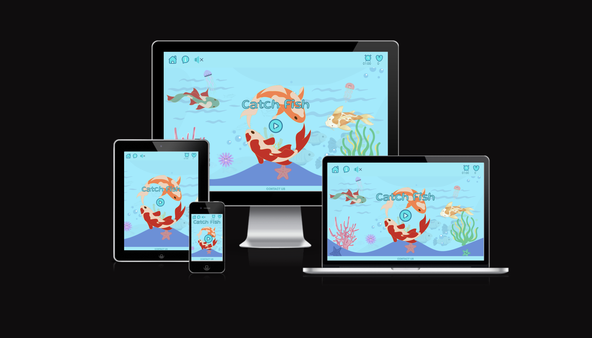
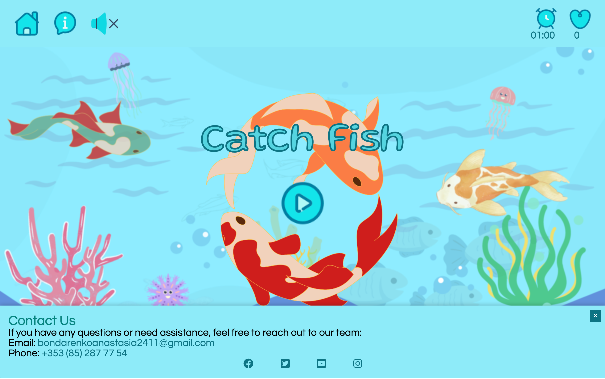
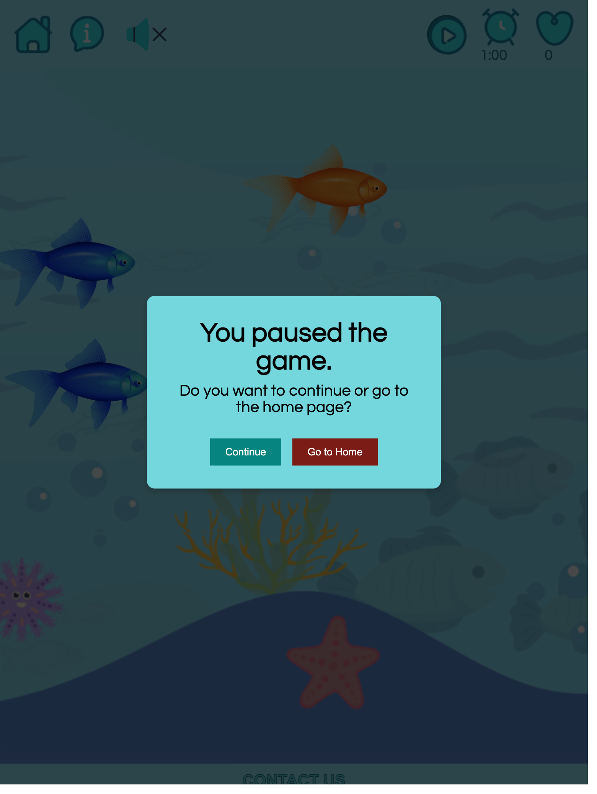
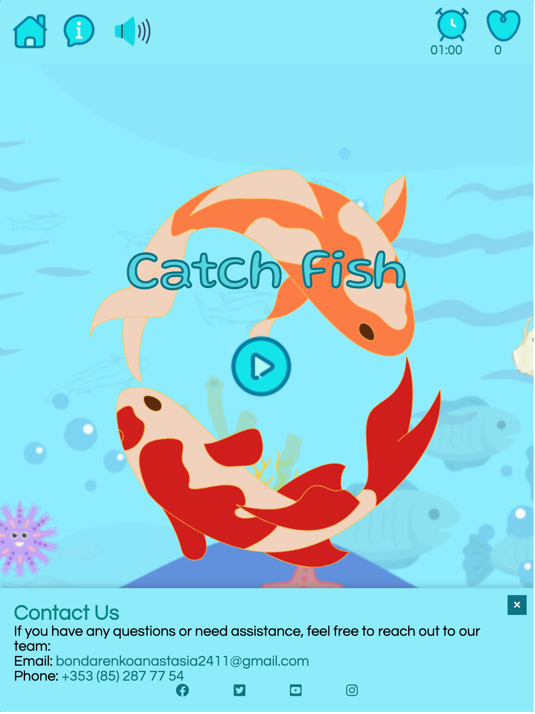
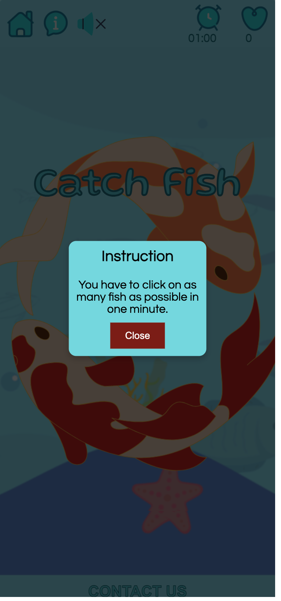
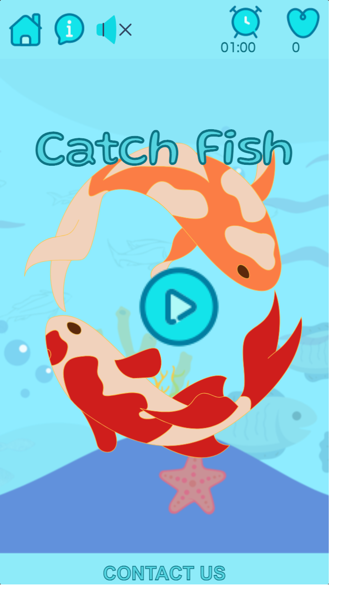
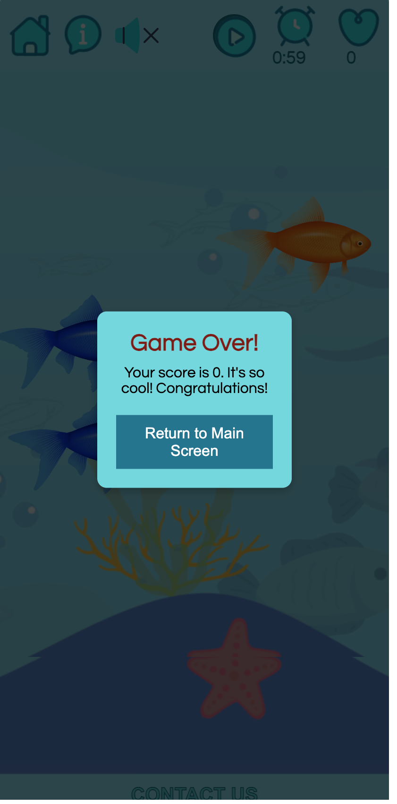

# TESTING

## Compatibility

To confirm correct functionality, responsiveness and appearance:

+ The site has been tested on the following browsers: Chrome, Firefox, Safari.

    - Chrome:

    
    
    - FireFox:

    
    

    - Safari:

    

    

---
## Responsiveness

+ The website was checked with [Responsive Viewer](https://chrome.google.com/webstore/detail/responsive-viewer/inmopeiepgfljkpkidclfgbgbmfcennb) extension in Google Chrome.

- Desktop Screen:

- Tablet Screen:

- Mobile Screen:

+ The functionality of the links in the website was checked as well by different users.

## Manual testing

| feature | action | expected result | tested | passed | comments |
| --- | --- | --- | --- | --- | --- |
| Header | | | | | |
| Home | Click on the "Home" link in the header. | The user should be redirected to the main page if game started.| Yes | Yes| --- |
| Rules| Click on the "Rules" link in the header. | The rules section or modal should open, providing instructions for the game. | Yes | Yes | --- |
| Sound On/Off | Click on the sound control icon in the header to toggle sound on and off. | Sound should either play or stop based on the current state, and the sound icon should change accordingly. | Yes | Yes | --- |
|  Pause |  Click on the "Pause" button during gameplay. | The game should pause, and a modal should appear asking if the player wants to continue or return to the home page. | Yes | Yes | ---  |
| Resume | Click on the "Continue" button in the pause modal. | The game should resume from where it was paused. | Yes | Yes | --- |
| Timer | Observe the timer in the game. | The timer should count down from 01:00 to 00:00. When it reaches 00:00, the game should end. | Yes | Yes | --- |
| Game Area | | | | | |
| Play | Click on the "Play" button. | The game should start, and the player should see the game area with fish swimming. | Yes | Yes | --- |
| Fish |  Click on one of the fish swimming in the game area. | The clicked fish should disappear, a catch sound should play, and the player's score should increase. | Yes | Yes | --- |
| Game Over | Wait for the game timer to reach 00:00. | A "Game Over" modal should appear, displaying the player's final score. | Yes | Yes | --- |
| Footer | | | | | |
| Contact | Click on the "Contact Us" button located in the footer. | A contact modal or section should appear with contact information, including email and phone number. | Yes | Yes | --- |
| Contact close |  If the contact modal or section is open, try closing it. | The contact modal or section should close, and the footer should return to its default state. | Yes | Yes | --- |

---
## Validator testing
+ ### HTML
  #### Home Page
    - No errors or warnings were detected when passing through the official W3C validator.

    
 
    
+ ### CSS

 - No errors or warnings were found when passing through the official W3C (Jigsaw) validator.
    
    

+ ## LightHouse report

    - Using lighthouse in devtools, I made sure the site works well, is accessible, and the colors and fonts chosen are readable.
    

---
​
## Bugs
+ ### Solved bugs
   - Redirection Error: The original issue was related to a redirection error when trying to redirect to window.location.origin at the end of the game. We fixed this by changing it to a relative URL using window.location.href = "https://anastassiiabondarenko.github.io/fish_game/";. This ensures that the game redirects to the link of the page, which should work correctly.

   - Bug: Score and Timer Icons Disappearing
Description: Score and timer icons were disappearing when the game started because they were placed inside  elements, and the JavaScript code was modifying the content of these elements.
Solution: The icons were repositioned outside of the  elements in the HTML structure, and the JavaScript code was adjusted to target the  element directly for updating the timer's text content. This separation of icons and text content resolved the issue.

 ---
